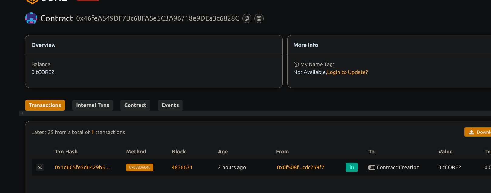

# Charity Donation Tracker with Transparent Fund Allocations

# Project Descriptions

This smart contract allows donors to contribute funds to registered charities with full the transparency. Each donation is tracked on-chain, and funds are immediately forwarded to the intended charity's address. The contract owner manages the list of valid charities.

## Project Visions

To create a transparent, accountable donation system that builds trust between donors and charities by ensuring all funds are traceable and reach the designated organizations promptly.

## Key Feature

Charity Management: Only the contract owner can add or remove charities.

Direct Donations: Donors can send Ether directly to any verified charity.

Transparent Records: Every donation is logged with donor, amount, and timestamp.

Instant Transfer: Donated funds are instantly sent to the charity’s wallet.

Event Logging: Emits events for donations, charity additions, and removals.

Cumulative Totals: Tracks and displays total donations per charity.

## Future Scope

- Add support for ERC20 token donations.
- Implement multi-signature approval for charity additions .
- Enable periodic audits and reports on donations.
- Build a front-end dashboard showing real-time donation stats.
- Integrate with identity verification to prevent fraud.

## Contract details
0x46feA549DF7Bc68FA5e5C3A96718e9DEa3c6828C

